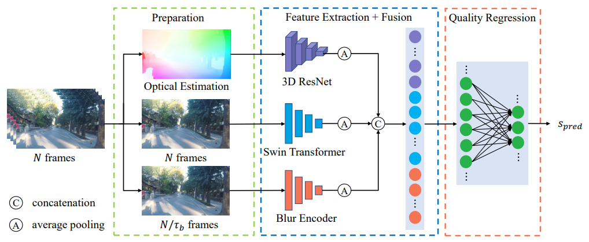

# StableVQA

Code for paper ["StableVQA: A Deep No-Reference Quality Assessment Model for Video Stability"](https://arxiv.org/abs/2308.04904) (Accepted by ACM MM'23)

<p align="center">
  
</p>

We propose StableVQA for accurate prediction of video stability. Flow Feature: After sampling N frames from the video clip, the optical flows between adjacent frames are estimated and are taken as input to a 3D CNN to implicitly analyze the camera movement.
Semantic feature: We use a Swin-T for the extraction of semantic features. Blur Feature: We analyze the motion blur effect within frames. Features from three dimensions are fused and regressed to give the final prediction stability score.

## Database

Download the [StableDB](https://drive.google.com/file/d/1XO1tkmSNg-yPcfQ0WSnpvB3mu0bILZQA/view?usp=drive_link), including 1952 unstable videos with corresponding MOSs.

## Pre-trained Weights

Download RAFT pre-trained weight [raft-things.pth](https://drive.google.com/drive/folders/1sWDsfuZ3Up38EUQt7-JDTT1HcGHuJgvT?usp=sharing)

Download StripFormer pre-trained weight [Stripformer_realblur_J.pth](https://drive.google.com/drive/folders/1YcIwqlgWQw_dhy_h0fqZlnKGptq1eVjZ?usp=sharing)

Download Swin Transformer pre-trained weight [swin_tiny_patch4_window7_224.pth](https://github.com/SwinTransformer/storage/releases/download/v1.0.0/swin_tiny_patch4_window7_224.pth)

You can download the pre-trained weight of StableVQA [here](https://drive.google.com/file/d/1V3PA99ShWQlJP7o-BOsHtXXmqPYuJFZU/view?usp=sharing).

The default path for these pre-trained weights is `./pretrained_weights/*.pth`.

## Environment

The project is built on python 3.7. Run `pip install -r requirements.txt` to install the dependencies. 

## Training

    python new_train.py -o ./options/stable.yml

## Testing

    python new_test.py -o ./options/stable.yml

## Citation
```bibtex
    If you use any part of this code, please kindly cite
    @inproceedings{kou2023stablevqa,
  title={Stablevqa: A deep no-reference quality assessment model for video stability},
  author={Kou, Tengchuan and Liu, Xiaohong and Sun, Wei and Jia, Jun and Min, Xiongkuo and Zhai, Guangtao and Liu, Ning},
  booktitle={Proceedings of the 31st ACM International Conference on Multimedia},
  pages={1066--1076},
  year={2023}
}
```
